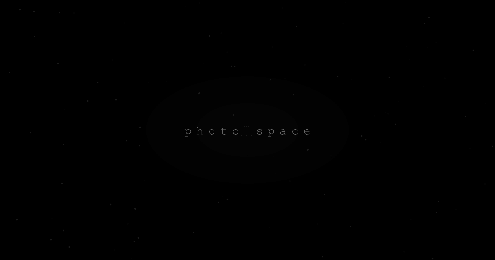

<h1 align="center">
  Photo Space
</h1>

<p align="center">
  An immersive 3D photo gallery
  <br />
  <br />
  <a href="https://photo-space.vercel.app">Live Demo</a>
  ·
  <a href="https://github.com/Kinterofoto/photo-space/issues">Issues</a>
</p>

<p align="center">
  <a href="https://nextjs.org">
    
  </a>
  <a href="https://threejs.org">
    
  </a>
  <a href="https://bun.sh">
    
  </a>
  <a href="https://supabase.com">
    
  </a>
  <a href="https://www.typescriptlang.org">
    
  </a>
</p>

## About

Photo Space renders your photos as floating cards in a 3D space. Navigate with orbit controls, click to download, and watch textures upgrade as you get closer. On mobile, a masonry gallery with a fullscreen viewer takes over.

## Get Started

```bash
git clone https://github.com/Kinterofoto/photo-space.git
cd photo-space
bun install
bun run dev
```

## Project Structure

```
src/
├── app/                  # Next.js app router
├── components/
│   ├── scene/            # 3D scene (R3F canvas, photo cards, particles, controls)
│   ├── mobile/           # Mobile gallery + photo viewer
│   └── ui/               # shadcn components
├── hooks/                # useManifest
├── lib/                  # Constants, utils
└── types/                # TypeScript definitions
```

## Scripts

```bash
bun run dev                # Dev server (Turbopack)
bun run build              # Production build
bun run generate-manifest  # Regenerate photo manifest from Supabase
```

## License

MIT
